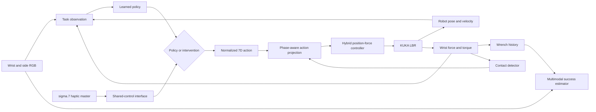
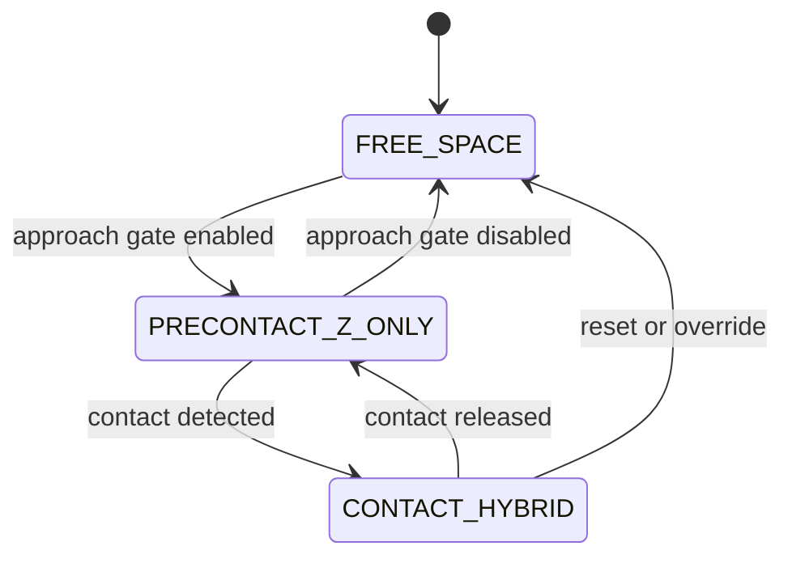

# System architecture

## Runtime control path

The learned policy and human operator share one action interface. Arbitration occurs before phase projection, so both command sources receive the same low-level safety and hybrid-control treatment.

## Control state machine

| State | Locked coordinates | Commanded coordinates |
| --- | --- | --- |
| `FREE_SPACE` | None | Cartesian position and orientation |
| `PRECONTACT_Z_ONLY` | Tangential position and orientation | Approach-axis position |
| `CONTACT_HYBRID` | Approach-axis position and orientation | Tangential position and normal force |

## Learning path

The actor collects robot transitions and sends them to an asynchronous learner. Demonstrations and interventions form additional replay sources. The learner samples from online and human-provided experience, updates the policy and critics, and periodically publishes policy parameters back to the actor. The multimodal success estimator supplies the task reward used in the transition stream.

This organization follows the HIL-SERL actor–learner pattern while changing the robot platform, teleoperation interface, action meaning, and reward inputs for deformable-surface contact.
